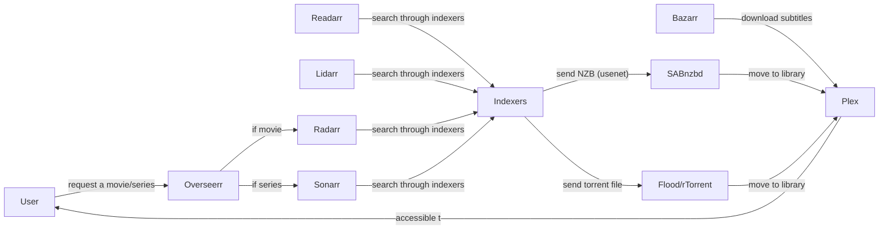
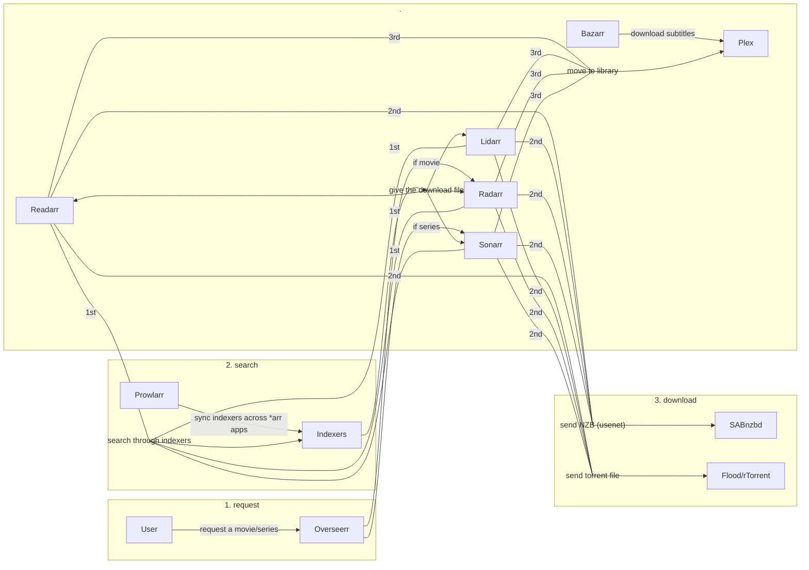

---
title:
  The Ultimate Guide to Setup Your Own Streaming Service with Sonarr, Radarr,
  Plex... using Usenet/Torrents
description:
  Step-by-step guide to setting up your own movie/series streaming service using
  Sonarr, Radarr, and Plex with Usenet/Torrents. Suitable for beginners and
  power users.
date: 2023-02-03T22:36:51.570Z
lastmod: 2023-02-03T22:36:53.186Z
draft: true
slug: ultimate-guide-setup-streaming-service-sonarr-radarr-plex-usenet-torrents
keywords:
  - netflix
  - streaming
  - self-hosted
  - plex
  - radarr
  - sonarr
  - torrent
  - usenet
---

# The Ultimate Guide to Setup Your Own Streaming Service with Sonarr, Radarr, Plex... using Usenet/Torrents

> This guide provides a step-by-step approach to setting up your own movie and series streaming service using Sonarr, Radarr, Overseer, and Plex. Whether you prefer using Usenet or torrents, this guide has got you covered. Designed for both beginners and power users, the guide will help you stream your favorite movies and series with ease. Say goodbye to the hassle of unreliable streaming services and hello to endless entertainment with the help of this ULTIMATE Guide.

---

## Why would you even want to do that?

Although the rise of other streaming services than Netflix had a very positive impact on the industry -- for the customer it means paying more and more monthly fees to streaming services, which can become very costly.

The setup carefully documented in this article -- while tedious if you don't have access to this ULTIMATE guide :) -- can save you a great amount of money while freeing you from large companies.

## How this guide is built? **_(must read)_**

This guide is meant to serve all users, from beginners to power users, from a simple configuration to a more complete one with more features and a better ease of use.

This said, at the beginning of each part, a section will explain what it is about and if you can skip it.

## Requirements

- A server (VPS or dedicated) and basic knowledge on how to connect. [See below which one to choose and how to connect](#which-server-to-choose-and-how-to-connect).
- Extremely basic knowledge on how to use a terminal.
- If you plan to use Usenet, a Usenet provider and a Usenet indexer. [See below why you would want this](#should-you-use-usenet-andor-torrents).
- A free [Plex](https://plex.tv) account.

## Which server to choose and how to connect?

You can freely skip this part if you already have a server and you know how to connect to it. Just be careful to make sure to have the recommended specifications defined below.

---

### Which server to choose?

Your server will store movies and series, this uses a lot of storage, therefore you need to rent a server specialized in storage, a server which have a lot of storage available for a fair price. Many popular server providers have those kind of offers. They are often called _Storage VPS_.

Also you **must** be careful of the connection speed available (in Mbps or Gbps). In my opinion your server must have at least 500 Mps even if 1 Gbps is always better. For example I personally have 4 Gbps.


I also recommend having more than 2 GB of RAM available.

> **Note**
> Thanks to [Oracle's enormous free-tier](https://www.oracle.com/cloud/free/) you can get a server with 4 GB of RAM and 24 TB of storage for almost free. Note that using Oracle Cloud is not recommended for beginners because it's not as easy to use as other providers. You would need quite some other steps to be able to use it. I might write a tutorial on how to do it if there is enough demand, feel free to ask in the comments ;).

When you get the choice of the operating system, I recommend using the latest version of Ubuntu, it will make following this tutorial easier.

### How to connect?

It depends if you're using an SSH key or a password. I recommand checking the documentation of your server provider to know how to connect to your server. But anyway here are the two most common ways to connect to a server.

> **Note**
> For security reasons, using the `root` user is a bad idea, but this goes out of the scope of this tutorial. Do your researches.

#### Using VSCode (recommended for ease of use)

1. Install [VSCode](https://code.visualstudio.com).
2. Install the [Remote - SSH](https://marketplace.visualstudio.com/items?itemName=ms-vscode-remote.remote-ssh) extension.
3. Click the bottommost-leftmost button > _Connect to Host..._ > _Add New SSH Host..._
4. Type `ssh root@<server-ip>` (replace `<server-ip>` with your server IP address).
5. If using a password, enter the provided password.
6. Press `` ctrl + shift + ` `` to open a terminal window.

#### Using a terminal

1. Type `ssh root@<server-ip>` (replace `<server-ip>` with your server IP address).
2. If using a password, enter the provided password.

## Should you use Usenet and/or Torrents?

You can freely skip this part if you are already sure you'll use Usenet and/or Torrents. Just be careful to make sure to follow the appropriate instructions for each.

---

### Quick comparison

|       | Usenet      | Torrents       |
| ----- | ----------- | -------------- |
| price | paid        | mostly free    |
| speed | always fast | really depends |

### Usenet

Usenet is a worldwide distributed discussion system available on computers [according to Wikipedia](https://en.wikipedia.org/wiki/Usenet). Basically, people upload all kind of stuff to usenet, including movies, series, books and music.

To access Usenet, you need a server and Usenet servers are too expensive to be self-hosted, consequently you usually rent part of them.

Also to actually find content on Usenet you need something like a search engine, which is called an indexer in this context. Some free indexers exists out there but they usually have important limitations, consequently, the usage of a paid one is strongly recommended.

> **Note**
> I personally subscribed to [Eweka](https://www.eweka.nl/en/landing/special-usenet-deal) for the Usenet server and [NZGgeek](https://nzbgeek.info) for the Usenet indexer but you absolutely don't need to choose them, many more providers exist.

> **Warning**
> Make sure to check if the movie/series you want to download is free of rights in your country. If it's not, you should not download it.

### Torrents

BitTorrent (torrents) is a communication protocol for peer-to-peer file sharing (P2P), which enables users to distribute data and electronic files over the Internet in a decentralized manner [according to Wikipedia](https://en.wikipedia.org/wiki/BitTorrent).

To be able to search for torrents you need something like a search engine, which is called an tracker in this context.

3 types of trackers exist, public ones, semi-private ones and private ones.

You generally cannot register to private trackers.

For semi-private trackers you need to register to access them and you need to maintain a ratio. This means that you need to share the files you previously downloaded at least as much as you downloaded them. In practice this means that you should not delete your files once you downloaded them so others are able to download theirs from you.

For public trackers you don't **need** to maintain a ratio but you still should, because if nobody shares the files they download, nobody would be able to download them. Be fair.

## Setup preliminaries

You cannot skip this part.

---

### Connect to your server

See [this](#how-to-connect).

### Install Docker

Steps from [here](https://docs.docker.com/engine/install/ubuntu/#install-using-the-repository).

```
sudo apt-get remove docker docker-engine docker.io containerd runc
sudo apt-get update
sudo apt-get install ca-certificates curl gnupg lsb-release
sudo mkdir -p /etc/apt/keyrings
curl -fsSL https://download.docker.com/linux/ubuntu/gpg | sudo gpg --dearmor -o /etc/apt/keyrings/docker.gpg
echo "deb [arch=$(dpkg --print-architecture) signed-by=/etc/apt/keyrings/docker.gpg] https://download.docker.com/linux/ubuntu $(lsb_release -cs) stable" | sudo tee /etc/apt/sources.list.d/docker.list > /dev/null
sudo apt-get update
sudo apt-get install docker-ce docker-ce-cli containerd.io docker-compose-plugin
```

### Setup the directory tree

Go to your desired directory (eg. `~/`).

Create this folder structure:

```
library
├── config
│   ├── bazarr
│   ├── lidarr
│   ├── overseerr
│   ├── plex
│   ├── prowlarr
│   ├── flood-rtorrent
│   ├── radarr
│   ├── readarr
│   ├── sabnzbd
│   └── sonarr
└── data
    ├── media
    │   ├── books
    │   ├── movies
    │   ├── music
    │   └── series
    ├── torrent
    │   ├── library
    │   └── other
    └── usenet
        ├── library
        └── other
```

You can use those commands to do it automatically for you.

```
mkdir -p library/config library/data
cd library/config
mkdir overseerr prowlarr bazarr sabnzbd flood-rtorrent sonarr radarr lidarr readarr plex
cd ../data
mkdir -p media/movies media/series media/books media/music
mkdir -p usenet/library usenet/other
mkdir -p torrent/library torrent/other
cd ..
```

### Setup permissions

```
sudo useradd library-user
sudo chown -R library-user:library-user .
```

🎉 You're done with the basics 🎉

## Understand the architecture

You cannot skip this step.

---



The graph above is a simplified version, if you want to understand the architecture more deeply extent the one below.

<details>
<summary>Real architecture</summary>



</details>

## Setup Docker compose

You cannot skip this part.

---

### Setup `docker-compose.yml`

```
cd <your-library-directory>
sudo touch docker-compose.yml
sudo chmod a+w docker-compose.yml
```

Edit the file using either `code docker-compose.yml` or `nano docker-compose.yml`.

<details>
<summary>Paste this inside</summary>

```yml
services:
  #Request
  overseerr:
    image: sctx/overseerr:latest
    container_name: library-overseerr
    env_file:
      - .env
    volumes:
      - ./config/overseerr:/app/config
    ports:
      - 5055:5055
    restart: unless-stopped
  #Search
  prowlarr:
    image: lscr.io/linuxserver/prowlarr:develop
    container_name: library-prowlarr
    env_file:
      - .env
    volumes:
      - ./config/prowlarr:/config
    ports:
      - 9696:9696
    restart: unless-stopped
  bazarr:
    image: lscr.io/linuxserver/bazarr:latest
    container_name: library-bazarr
    env_file:
      - .env
    volumes:
      - ./config/bazarr:/config
      - ./data:/data
    ports:
      - 6767:6767
    restart: unless-stopped
  #Download
  sabnzbd:
    image: lscr.io/linuxserver/sabnzbd:latest
    container_name: library-sabnzbd
    env_file:
      - .env
    volumes:
      - ./config/sabnzbd:/config
      - ./data/usenet:/data/usenet
    ports:
      - 8080:8080
    restart: unless-stopped
  rtorrent-flood:
    image: jesec/rtorrent-flood:latest
    container_name: library-rtorrent-flood
    user: ${PUID}:${PGID}
    command: --host 0.0.0.0 --rundir=/data
    env_file:
      - .env
    environment:
      - HOME=/config
    volumes:
      - ./config/rtorrent-flood:/config
      - ./data/torrent:/data/torrent
    ports:
      - 3000:3000
      - 6881:6881
    restart: unless-stopped
  #Manage
  sonarr:
    image: lscr.io/linuxserver/sonarr:latest
    container_name: library-sonarr
    env_file:
      - .env
    volumes:
      - ./config/sonarr:/config
      - ./data:/data
    ports:
      - 8989:8989
    restart: unless-stopped
  radarr:
    image: lscr.io/linuxserver/radarr:latest
    container_name: library-radarr
    env_file:
      - .env
    volumes:
      - ./config/radarr:/config
      - ./data:/data
    ports:
      - 7878:7878
    restart: unless-stopped
  lidarr:
    image: lscr.io/linuxserver/lidarr:latest
    container_name: library-lidarr
    env_file:
      - .env
    volumes:
      - ./config/lidarr:/config
      - ./data:/data
    ports:
      - 8686:8686
    restart: unless-stopped
  readarr:
    image: lscr.io/linuxserver/readarr:develop
    container_name: library-readarr
    env_file:
      - .env
    volumes:
      - ./config/readarr:/config
      - ./data:/data
    ports:
      - 8787:8787
    restart: unless-stopped
  #Watch
  plex:
    image: lscr.io/linuxserver/plex:latest
    container_name: library-plex
    network_mode: host
    env_file:
      - .env
    volumes:
      - ./config/plex:/config
      - ./data/media:/data/media
    restart: unless-stopped
```

</details>

As you can see this file is composed of a list of services: _overseerr_, _prowlarr_, _bazarr_...

- If you don't plan on needing subtitles you can remove _bazarr_.
- If you don't plan on using Usenet you can remove _sabnzbd_.
- If you don't plan on using torrents you can remove _flood_ and _rtorrent_.
- If you don't plan on downloading (TV) series you can remove _sonarr_.
- If you don't plan on downloading movies you can remove _radarr_.
- If you don't plan on downloading books you can remove _readarr_.
- If you don't plan on downloading music you can remove _lidarr_.

### Setup `.env`

```
cd <your-library-directory>
sudo touch .env
sudo chmod a+w .env
```

Edit the file using either `code .env` or `nano .env`.

<details>
<summary>Paste this inside</summary>

```ini
#General
PUID=1001
PGID=1001
TZ=Europe/Helsinki

#Plex
VERSION=docker
PLEX_CLAIM=temp
```

</details>

Run `id library-user` and paste the `uid` value to the `PUID` variable and the the `gid` value to the `PGID` variable.

Set the `TZ` variable to [your timezone](https://timezonedb.com/time-zones).

### Start Docker compose

```
cd <your-library-directory>
sudo docker compose up -d
```

🎉 You're done with Docker compose 🎉

## Setup subdomains and HTTPS

You can freely skip this part if you don't have a domain name or don't want to setup it. If you have a domain name it's recommended to setup this for ease of use of your home brewed library and being able to access it with a secure HTTPS connection.

---

### Setup the subdomains

Connect to your DNS provider dashboard. It will look similar to this:


You need to add a _A record_ for every subdomain, the content of the record will be your server's IP address. It will look similar to this:


### Setup Caddy

Install Caddy (steps from [here](https://caddyserver.com/docs/install#debian-ubuntu-raspbian)).

```
sudo apt install -y debian-keyring debian-archive-keyring apt-transport-https
curl -1sLf 'https://dl.cloudsmith.io/public/caddy/stable/gpg.key' | sudo gpg --dearmor -o /usr/share/keyrings/caddy-stable-archive-keyring.gpg
curl -1sLf 'https://dl.cloudsmith.io/public/caddy/stable/debian.deb.txt' | sudo tee /etc/apt/sources.list.d/caddy-stable.list
sudo apt update
sudo apt install caddy
```

Create the configuration file

```
cd <your-library-directory>
sudo touch Caddyfile
sudo chmod a+w Caddyfile
```

Edit the file using either `code Caddyfile` or `nano Caddyfile`.

<details>
<summary>Paste this inside</summary>

```Caddyfile
overseerr.example.org {
	reverse_proxy localhost:5055
}
prowlarr.example.org {
	reverse_proxy localhost:9696
}
bazarr.example.org {
	reverse_proxy localhost:6767
}
sabnzbd.example.org {
	reverse_proxy localhost:8080
}
flood.example.org {
	reverse_proxy localhost:3000
}
sonarr.example.org {
	reverse_proxy localhost:8989
}
radarr.example.org {
	reverse_proxy localhost:7878
}
lidarr.example.org {
	reverse_proxy localhost:8686
}
readarr.example.org {
	reverse_proxy localhost:8787
}
plex.example.org {
	reverse_proxy localhost:32400
}

```

</details>

Replace `example.org` with your domain name.

Run Caddy

```
cd <your-library-directory>
sudo caddy stop
sudo caddy start
```

> **Warning**
> In the guide you will often find configuration panels similar to this one:
>
> 
>
> You will always need to set host to `<service-name>.<your-domain-name>` instead of what asked, port to `443` instead of what asked and check the `SSL` checkbox.

🎉 You're done with Caddy 🎉

## Setup download clients

You cannot skip this part.

---

### Usenet

Allow remote access to SABnzbd.

```
cd <your-library-directory>
cd config/sabnzbd
sudo chmod a+rw sabnzbd.ini
```

Edit the file using either `code sabnzbd.ini` or `nano sabnzbd.ini`. Modify the variable `inet_exposure` (line 33) to `inet_exposure = 4`.

> **Warning**
> If you [set up the subdomains and HTTPS](#setup-subdomains-and-https) you should also modify the variable `host_whitelist` (line 149) by adding your hostname at the end. It will look similar to `host_whitelist = 78d983e0ae14,sabnzbd.example.org`.

Restart Docker compose using `sudo docker compose restart sabnzbd`.

Access SABnzbd in a browser (`<your-server-ip>:8080`).

> **Note**
> If you [set up the subdomains and HTTPS](#setup-subdomains-and-https) you should access it using `sabnzbd.example.org`.

Select the desired language, click _Start Wizard_.

Configure the fields according to what your Usenet providers gives you. For example with those information:


I would setup SABnzbd like this:


Click _Test Server_ to make sure you entered the fields correctly, click _Next_, click _Go to SABnzbd_, click the top-right gear icon, click _General_.

Under _Security_, set a _SABnzbd Username_ and a _SABnzbd Password_ and click the _Save Changes_ button bellow, click _OK_ in the popup and wait for the restart to complete. You can now login and go to the settings again.

> **Note**
> If SABnzbd fails to restart automatically, restart it manually using `sudo docker compose restart sabnzbd`.

Go to the _Folders_ tab and configure the _Completed Download Folder_ to `/data/usenet`, save changes.

Go to the _Catagories_ tab and remove all the default categories using the trash bin icons on the right. Configure the default category's _Folder/Path_ to `other`, save. Add a new category named `library` with _Folder/Path_ set to `library`, click _Add_.

Go to the _Switches_ tab and tick _Direct Unpack_ under _Queue_, save.

🎉 You're done with SABnzbd 🎉

### torrents

Access Flood in a browser (`<your-server-ip>:3000`).

> **Note**
> If you [set up the subdomains and HTTPS](#setup-subdomains-and-https) you should access it using `flood.example.org`.

Enter a username and a password. Set _Path_ to `/config/.local/share/rtorrent/rtorrent.sock`. Click on _Create Account_.

Click the settings gear on the top-left corner. Go in the _Resources_ tab, set the _Default Download Directory_ to `/data/torrent/other`, click _Save Settings_.

🎉 You're done with Flood 🎉

## Setup Prowlarr

You cannot skip this part.

---

Access Prowlarr in a browser (`<your-server-ip>:9696`).

> **Note**
> If you [set up the subdomains and HTTPS](#setup-subdomains-and-https) you should access it using `prowlarr.example.org`.

Select _Forms (Login Page)_, set a _Username_ and a _Password_ and click _Save_.

Click _Add indexer_ on the top panel, search for the Usenet or torrent indexers you want to add, fill the required fields, click on _Test_ then _Save_ if successful.

> **Note**
> In my case I search for `NZBgeek` and fill this form with my NZBgeek's API key.
> 
> I also want this indexer to have the most priority so I set the _Indexer priority_ field to `1`.
> Then I want to add a french torrent indexer but with a priority set to `2` etc.

> **Note**
> If you don't know what Usenet/torrent indexers to use, set the _Privacy_ filter to `Public` and add some.

On the left side panel click _Settings_, then _UI_, then you may want to change some formats under the _Dates_ category and click _Save_ on the top panel.

On the left side panel click _Settings_, then _Apps_, then the _+_ icon.

<details>
<summary>These steps will need to be repeated for Sonarr, Radarr, Lidarr (if you want to download music/audio) and Readarr (if you want to download eBooks).</summary>
<br/>

Click on _Sonarr_/_Radarr_/_Lidarr_/_Readarr_.

Set _Sync Level_ to _Full Sync_.

In the _Prowlarr Server_ field enter `http://<your-server-ip>:9696`, replace `<your-server-ip>` by your server IP address.

> **Note**
> If you [set up the subdomains and HTTPS](#setup-subdomains-and-https) you should set the field to `https://prowlarr.example.org` instead.

In the _\*arr Server_ field enter `http://<your-server-ip>:<the-*arr-app-port>`, replace `<the-*arr-app-port>` by `8989` for Sonarr, by `7878` for Radarr, by `8686` for Lidarr and by `8787` for Readarr.

> **Note**
> If you [set up the subdomains and HTTPS](#setup-subdomains-and-https) you should set the field to `https://<the-*arr-app-name>.example.org` instead.

Access the \*arr app using a browser, on the left side panel click _Settings_, then _General_, then copy the _API Key_ under _Security_. Paste it in the _ApiKey_ field, press _Save_.

</details>

🎉 You're done with Prowlarr 🎉

## Setup Bazarr

You cannot skip this part.

---

Access Bazarr in a browser (`<your-server-ip>:6767`).

> **Note**
> If you [set up the subdomains and HTTPS](#setup-subdomains-and-https) you should access it using `bazarr.example.org`.

### General

On the left side panel click _Settings_, then _General_, set the _Authentication_ field to `Form`, fill the _Username_ and _Password_ fields and click _Save_ on the top panel.

### Languages

On the left side panel click _Settings_, then _Languages_, in the _Languages Filter_ field select the language(s) you want to request for subtitles and click _Add New Profile_.

Write `Main` in the _Name_ field. Click on _Add Language_ **n** times while **n** being the number of languages your want your subtitles in. In the second row of the table make sure each line have a unique language. Click _Save_, click _Save_ on the top panel.

### Providers

On the left side panel click _Settings_, then _Providers_, then click on _+_. Most subtitles providers require login-in, therefore you will most likely need to first create an account on the provider website and then fill your _Username_ and _Password_ of that provider the fields you will get after selecting a provider.

I personally recommend to add at least `OpenSubtitles.com` and then to scroll though the list to see if some providers may provide you with subtitles in your native language.

Click on _Save_ each time and on _+_ again if you want to add another one.

Click on the top panel _Save_ button.

### Sonarr & Radarr link

On the left side panel click _Settings_, then _Sonarr_, then enable it.

Fill the _Address_ field with `<your-server-ip>`.

> **Note**
> If you [set up the subdomains and HTTPS](#setup-subdomains-and-https) you should fill the _Address_ field with `sonarr.example.org`, the _Port_ field with `443` and enable _SSL_.

Access the Sonarr app using a browser, on the left side panel click _Settings_, then _General_, then copy the _API Key_ under _Security_. Paste it in the _API Key_ field.

Press _Test_ and then the _Save_ button on the top panel.

On the left side panel click _Settings_, then _Radarr_, then enable it and then perform the same last actions but with Radarr.

🎉 You're done with Bazarr 🎉

## Setup \*arr apps

These steps will show the setup for all Sonarr, Radarr, Lidarr and Readarr apps at the same time because they are very similar. You are free to skip either Lidarr and/or Readarr if you don't want to download music/audios and/or eBooks respectively.

---

Access \*arr in a browser (`<your-server-ip>:<the-*arr-app-port>`), replace `<the-*arr-app-port>` by `8989` for Sonarr, by `7878` for Radarr, by `8686` for Lidarr and by `8787` for Readarr.

> **Note**
> If you [set up the subdomains and HTTPS](#setup-subdomains-and-https) you should set the field to `<the-*arr-app-name>.example.org` instead.

### Root folder

On the left side panel click _Settings_, then _Media Management_.

<details>
  <summary>Sonarr and Radarr specific</summary>

Click on _Add Root Folder_ under _Root folders_. Navigate to `/data/media/series/`
for Sonarr, to `/data/media/movies/` for Radarr and click _Ok_.

</details>

<details>
  <summary>Lidarr and Readarr specific</summary>

Click on _+_ under _Root folders_. Set the _Name_ field to `Main`. For the _Path_
field navigate to `/data/media/music/` for Lidarr, to `/data/media/books/` for
Readarr and click _Save_.

</details>

### Language

<details>
  <summary>Sonarr specific</summary>

On the left side panel click _Settings_, then _Profiles_, then click on _English_
under _Language Profiles_. You may want to add more languages then English, tick
the one you want, change the _Name_ field to _Main_ and click _Save_.

</details>

<details>
  <summary>Radarr specific</summary>

On the left side panel click _Settings_, then _Profiles_, then for each quality
you will use: click the quality name, set the _Language_ field to `Original` and
click _Save_.

</details>

### Quality

<details>
  <summary>Sonarr and Radarr specific</summary>

On the left side panel click _Settings_, then _Quality_, then make sure the gear icon on the top is named _Hide Advanced_. In my case I watch movies and series in 1080p, so for each
quality name that contains `1080`, I will set its corresponding _Max_ field to something
like `80`. This way, \*arr will only download files with a maximum ratio of 4.7 GB
per hour. Otherwise your server's disk will get full quickly. _Radarr_ requires
you to set a _Preferred_ value too. Click _Save_.

</details>

### Download clients

On the left side panel click _Settings_, then _Download Clients_, then click on _+_.

<details>
<summary>Usenet specific</summary>

Click on _SABnzbd_, write `SABnzbd` in the _Name_ field. Write `<your-server-ip>` in the _Host_ field and `8080` in the _Port_ field.

> **Note**
> If you [set up the subdomains and HTTPS](#setup-subdomains-and-https) you should write `sabnzbd.example.org` in the _Host_ field, `443` in the _Port_ field and tick _Use SSL_.

Access _SABnzbd_ in a new tab. Click on the top-right gear icon, then the _General_ tab and copy the _API Key_ under _Security_. Paste this key in the _API Key_ field.

Fill the _Username_ and _Password_ fields with the same one you used in SABnzbd.

Write `library` in the _Category_ field and press _Save_.

</details>

<details>
<summary>Torrent specific</summary>

Click on _Flood_, write `Flood` in the _Name_ field. Write `<your-server-ip>` in the _Host_ field and `3000` in the _Port_ field.

> **Note**
> If you [set up the subdomains and HTTPS](#setup-subdomains-and-https) you should write `flood.example.org` in the _Host_ field, `443` in the _Port_ field and tick _Use SSL_.

Fill the _Username_ and _Password_ fields with the same one you used in Flood.

Set the _Destination_ field to `/data/torrent/library`, the _Tags_ field to `library` and press _Save_.

</details>

### General

On the left side panel click _Settings_, then _UI_, then you may want to change some formats under the _Calendar_ and _Dates_ categories and click _Save_ on the top panel.

On the left side panel click _Settings_, then _General_, set the _Authentication_ field to `Form (Login Page)`, fill the _Username_ and _Password_ fields and click _Save_ on the top panel.
If it asks, clik on _Restart Now_.

🎉 You're done with one \*arr app 🎉

Now do [this again](#setup-arr-apps) for each \*arr app **_:)_**.

🎉 You're done with every \*arr app 🎉

## Setup Plex

You cannot skip this part.

---

```
cd <your-library-directory>
sudo docker compose stop plex
```

Create a Plex account [here](https://www.plex.tv/sign-up/).

Edit the `.env` file using either `code .env` or `nano .env`.

Go to [plex.tv/claim](https://plex.tv/claim) and paste the code to your `PLEX_CLAIM` variable.

Relaunch Docker compose using `sudo docker compose up -d plex`.

Access Plex in a browser (`<your-server-ip>:32400`).

> **Note**
> If you [set up the subdomains and HTTPS](#setup-subdomains-and-https) you should access it using `plex.example.org`.

Log in with your Plex account.

Click _GOT IT!_, close the popup, give your library a nice name.

Click _ADD LIBRARY_, then _Movies_, then _NEXT_, then _BROWSE FOR MEDIA FOLDER_, browse to `/data/media/movies`, click _ADD LIBRARY_.

Click _ADD LIBRARY_, then _TV Shows_, write `Series` in the _Name_ field, then click on _NEXT_, then _BROWSE FOR MEDIA FOLDER_, browse to `/data/media/series`, click _ADD LIBRARY_.

Click _ADD LIBRARY_, then _TV Shows_, write `Music` in the _Name_ field, then click on _NEXT_, then _BROWSE FOR MEDIA FOLDER_, browse to `/data/media/music`, click _ADD LIBRARY_.

Click on _NEXT_ then _DONE_.

Click the top-right wrench icon.

On the left side panel, scroll down and click on _Library_ under _Settings_. Tick _Scan my library automatically_ and _Run a partial scan when changes are detected_. Set the _Generate video preview thumbnails_ and _Generate chapter thumbnails_ fields to `as a scheduled task and when media is added` and click on _Save Changes_.

On the left side panel, click on _Quality_ under _Plex Web_, here you may want to set a different default _Video quality_, `10 Mbps, 1080p` as for myself.

If you want to be able to access your Plex library directly access Plex via [plex.tv](https://plex.tv) you need to allow the port `32400` in your firewall and router too if using something like Oracle Cloud.
Then go _Remote Access_ tab under _Settings_, tick _Manually specify public port_, set it to `32400` and click _Apply_, if you configured your router/firewall correctly it should say _Fully accessible outside your network_.

🎉 You're done with Plex 🎉

## Setup Overseerr

You cannot skip this part.

---

Access Overseerr in a browser (`<your-server-ip>:5055`).

> **Note**
> If you [set up the subdomains and HTTPS](#setup-subdomains-and-https) you should access it using `overseerr.example.org`.

Sign in with Plex.

Click the refresh icon on the right, wait and select one entry, you should prioritize `[secure]` then `[local]`. Click on _Save changes_, select _Movies_ and _Series_ and click on _Continue_.

### Radarr & Sonarr

Click on _Add Radarr Server_, tick _Default server_, write `Radarr` in the _Server name_ field, write `<your-server-ip>` in the _Hostname or IP Address_ field.

> **Note**
> If you [set up the subdomains and HTTPS](#setup-subdomains-and-https) you should write `radarr.example.org` instead, write `443` in the _Port_ field and tick _Use SSL_.

Access the Radarr app using a browser, on the left side panel click _Settings_, then _General_, then copy the _API Key_ under _Security_. Paste it in the _API Key_ field.

Click the yellow _Test_ button. Select your desired quality profile, select the only root folder available.

<details>
  <summary>Sonarr specific</summary>

Select the only language profile available, select your desired anime quality profile,
select the only root folder available, select the only anime language profile available
and tick _Season Folders_.

</details>

Tick _Enable Scan_ and click _Add Server_.

Perform the same last actions but with Sonarr now.

Click _Finish Setup_.

Click _Settings_, the _Users_ tab, go down a bit and tick _Auto-Approve_, then tick _Auto-Request_ and click _Save Changes_.

🎉 You're done with Overseerr 🎉

## How to use

You can freely skip this part if you already know how to use Overseerr and Plex.

---

### Overseerr

Congratulations for following up this guide until the end! Now you are able to request a movie/series/TV show directly from Overseerr and watch it from Plex.

Access Overseerr in a browser (`<your-server-ip>:5055`).

> **Note**
> If you [set up the subdomains and HTTPS](#setup-subdomains-and-https) you should access it using `overseerr.example.org`.

Search for a movie/series/TV show on the top search bar, select the correct one, click request, if it's a series you select the season(s) you want, click confirm and that's it!

If you click on that movie again you can quickly access it's corresponding Sonarr/Radarr page.

I can recommend you lurking around the app to discover nice features and have fun while your movie is downloading :)

### Plex

Access Plex in a browser via [plex.tv](https://plex.tv).

Click on the top-right wrench icon, on the left side panel click on _Manage Library Access_.

You can easily invite your friends and family to your Plex and Overseer, just ask them to create a Plex account, then you can add them by clicking on _GRANT LIBRARY ACCESS_ and entering their email/username. This way they can request movies too and watch them too, just like you.

I can recommend you lurking around the app to discover nice features :)

## Going forward

You can freely skip this step if you want to.

---

In this part it will not be a step-by-step guide but ideas to improve your nearly set up ULTIMATE Overseerr n' Plex n' chill.

- You check out the amazing mobile (iOS/Android) app **[LunaSea](https://lunasea.app)**. It gives you a very nice looking interface to access your SABnzbd, Sonarr, Radarr and Lidarr apps. Of course it has many other nice features.

This guide has been a long time in the planning and writing process. If you enjoyed it consider writing a comment to this article and following me on Github ([@Hunam6](https://github.com/hunam6)) and Twitter ([@Hunam\_](https://twitter.com/hunam_)). Thank you 🙏

---

**_Made by ❤️ with 🌸 power by [@Hunam6](https://github.com/hunam6)._**

<script
  src="https://giscus.app/client.js"
  data-repo="hunam6/hunam-website"
  data-repo-id="R_kgDOHDYEXw"
  data-category="Announcements"
  data-category-id="DIC_kwDOHDYEX84CXU1P"
  data-mapping="title"
  data-strict="0"
  data-reactions-enabled="1"
  data-emit-metadata="0"
  data-input-position="top"
  data-theme="preferred_color_scheme"
  data-lang="en"
  data-loading="lazy"
  crossOrigin="anonymous"
  async
></script>
